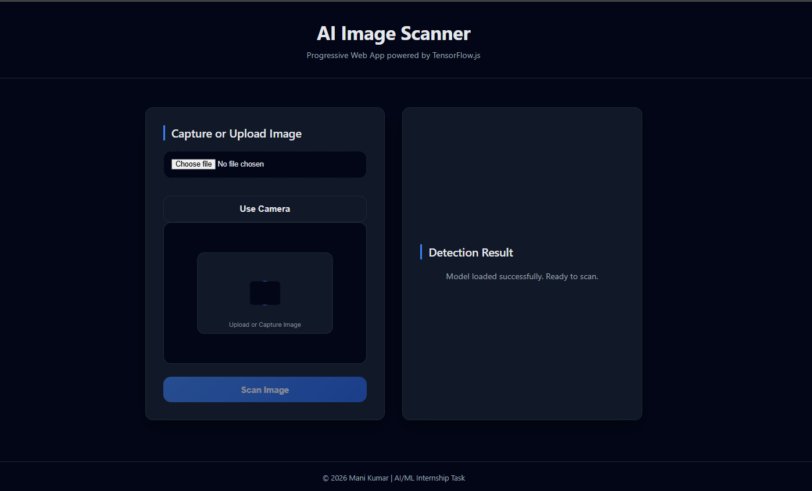
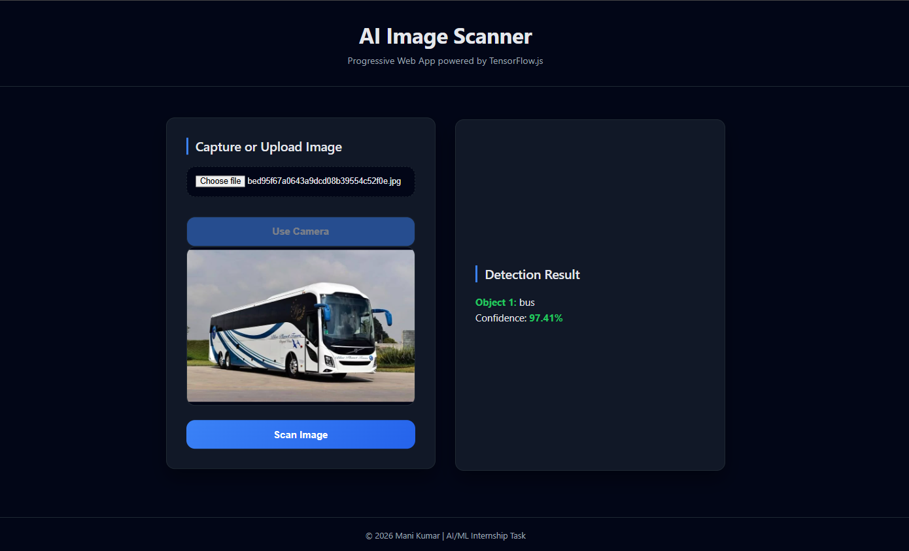

# 🚀 AI Image Scanner – Progressive Web App (PWA)

> **A world‑class AI/ML internship task showcasing real‑time image scanning using TensorFlow.js with camera and upload support, built as a Progressive Web App (PWA).**

---

## 📌 Project Overview

**AI Image Scanner** is a modern Progressive Web Application that allows users to **upload an image or capture one using the device camera** and perform **real‑time object detection directly in the browser** using **TensorFlow.js**.

The project is designed with **clean architecture, professional UI, and real‑world engineering practices**, making it suitable for production‑level AI web applications.

---

## 🎯 Aim of the Project

The primary aim of this project is to:

* Build a **browser‑based AI image scanning system**
* Demonstrate **hands‑on experience with TensorFlow.js**
* Implement a **Progressive Web App (PWA)** with offline support
* Provide a **clean, intuitive, and professional user interface**
* Showcase **camera integration, AI inference, and UI/UX best practices**

This project is developed as part of a **mandatory AI/ML internship technical task**.

---

## ✨ Key Features

* 📸 **Image Upload & Live Camera Capture**
* 🧠 **Real‑time Object Detection using TensorFlow.js (COCO‑SSD)**
* 🌐 **Client‑side AI Inference (No backend required)**
* 📱 **Progressive Web App (Installable & Offline Support)**
* 🎨 **Professional Dark UI with Responsive Design**
* ⚡ **Optimized Performance & Clean Architecture**

---

## 🛠️ Technologies & Tools Used

| Category   | Technology                        |
| ---------- | --------------------------------- |
| Frontend   | HTML5, CSS3, JavaScript           |
| AI / ML    | TensorFlow.js, COCO‑SSD Model     |
| PWA        | Web App Manifest, Service Worker  |
| APIs       | MediaDevices API (Camera Access)  |
| Deployment | GitHub Pages / Netlify (optional) |

---

## 🧱 Project Architecture

```
AI-Image-Scanner/
├── index.html              # Main entry point
├── manifest.json           # PWA configuration
├── service-worker.js       # Offline caching & performance
├── css/
│   └── styles.css          # Global styling & UI
├── js/
│   ├── app.js              # Application controller & UI logic
│   ├── camera.js           # Camera access & capture logic
│   └── tf-model.js         # TensorFlow model abstraction
├── assets/
│   ├── icons/
│   │   ├── icon-192.png
│   │   └── icon-512.png
│   └── placeholder.png
├── screenshots/
│   ├── home.png            # Home screen (before scan)
│   └── result.png          # Detection result screen
└── README.md               # Project documentation
```

---

## 🔄 Project Workflow (Execution Flow)

1. **Application Launch**

   * User opens the app via browser or installed PWA

2. **Model Initialization**

   * TensorFlow.js and COCO‑SSD model are loaded in the background

3. **Image Input**

   * User uploads an image **OR** captures one using the device camera

4. **Image Preview**

   * Selected or captured image is displayed in the preview panel

5. **Scan Image**

   * User clicks the **Scan Image** button

6. **AI Inference**

   * Image is passed to TensorFlow.js for object detection

7. **Result Display**

   * Detected objects and confidence scores are displayed

---

## 🖼️ Screenshots

### 🔹 Home Screen (Before Scan)



---

### 🔹 Detection Result Screen (After Scan)




---

## 📱 Progressive Web App (PWA) Features

* ✔ Installable on mobile & desktop
* ✔ Offline support using Service Worker
* ✔ Faster load times through asset caching
* ✔ App‑like user experience

---

## 🧠 AI Model Details

* **Model Used:** COCO‑SSD (Pre‑trained object detection model)
* **Framework:** TensorFlow.js
* **Inference Location:** Client‑side (Browser)
* **Output:**

  * Detected object labels
  * Confidence scores (%)

The AI logic is fully separated from UI logic using a clean module abstraction.

---

## 🔐 Permissions & Security

* Camera access is requested **only when the user clicks “Use Camera”**
* No images or data are stored or sent to any server
* Entire processing happens locally in the browser

---

## 🧪 How to Run the Project Locally

> ⚠️ Camera & PWA features require a local server (not file://)

### Option 1: VS Code Live Server

1. Open the project folder in VS Code
2. Right‑click `index.html`
3. Select **Open with Live Server**

### Option 2: Python Server

```bash
python -m http.server 5500
```

Then open:

```
http://localhost:5500
```

---

## 🧩 Challenges Faced & Solutions

* **Service Worker caching issues** → Resolved by cache control & unregistering stale workers
* **Camera + Upload integration** → Solved using a unified image pipeline
* **TensorFlow memory management** → Handled using scoped execution

These challenges strengthened real‑world debugging and architectural skills.

---

## 🚀 Future Enhancements

* Bounding boxes over detected objects
* Multi‑object detection visualization
* Model selection (custom models)
* Image history & analytics

---

## 👨‍💻 Author

**Mani Kumar**
AI / ML Enthusiast
